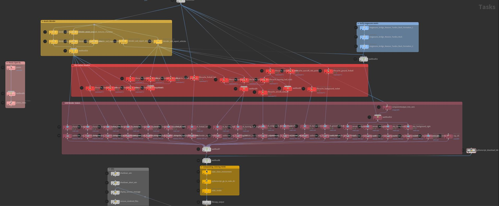

## Requirements
### Harware
* 100 GB storage
* 64 GB RAM
* 8 GB VRAM
* Internet connection

### Software
* [Houdini FX 19.5.569](https://www.sidefx.com/download/daily-builds/)
* [Blender 3.5.1](https://www.blender.org/download/releases/3-5/)
* [Bridge](https://quixel.com/bridge)
* [Foundry Nuke 14.0v3](https://www.foundry.com/products/nuke-family/non-commercial)
    * [Lens Engine](https://www.nukepedia.com/gizmos/draw/lens-engine)
* [ACES OCIO environment variable](https://opencolorio.readthedocs.io/en/latest/guides/using_ocio/using_ocio.html)
    * Example `OCIO="C:\Program Files\Nuke14.0v3\plugins\OCIOConfigs\configs\aces_1.2\config.ocio"`

### Instruction
* install required software
* Intstall folowing assets from Bridge
    * https://quixel.com/assets/wd4icipcb
    * https://quixel.com/assets/vivvecldw
    * https://quixel.com/assets/vi5gdad
* open `.hip` project
* check software installation paths in `/tasks/topnet1/control_network`
* cook node `/tasks/topnet1/output0`
* after a couple of hours (or days) output will be saved to `/video/`

### VFX Pipeline

### Render
