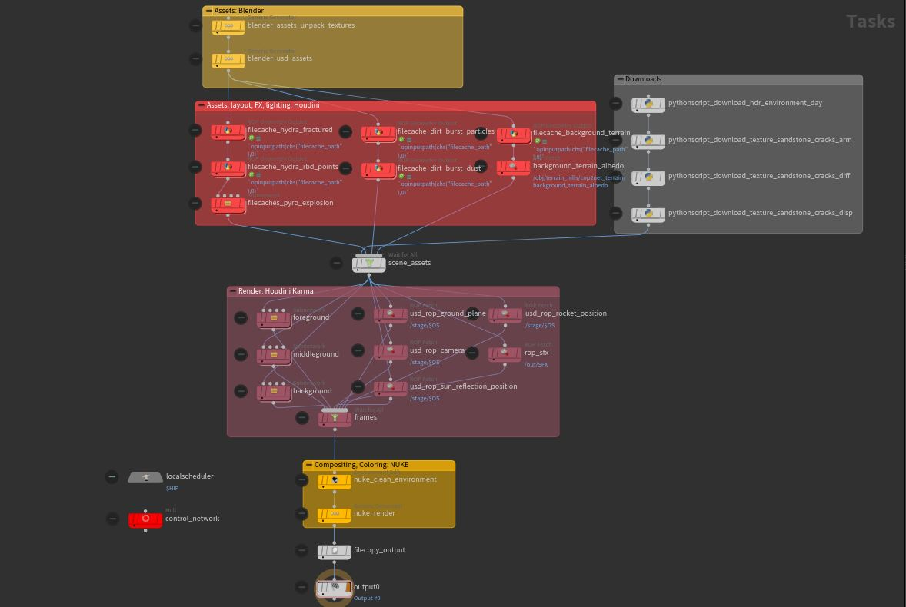

## Requirements
### Harware
* 200 GB storage
* 64 GB RAM
* 8 GB VRAM
* Internet connection

### Software
* SideFX Houdini 19
* Blender 3
* Foundry Nuke 13
    * [Lens Engine](https://www.nukepedia.com/gizmos/draw/lens-engine)
* [ACES OCIO environment variable](https://opencolorio.readthedocs.io/en/latest/guides/using_ocio/using_ocio.html)
    * Example `OCIO="C:\Program Files\Nuke13.2v4\plugins\OCIOConfigs\configs\aces_1.2\config.ocio"`

### Instruction
* install required software
* open `.hip` project
* check software installation paths in `/tasks/topnet1/control_network`
* cook node `/tasks/topnet1/output0`
* after a couple of hours (or days) output will be saved to `/videos/day.mov`

### VFX Pipeline

### Render
