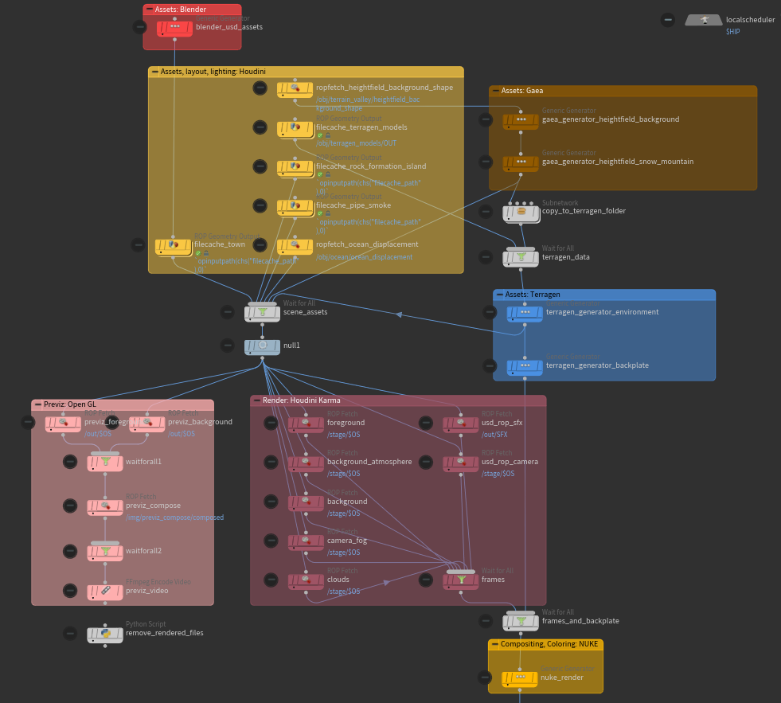
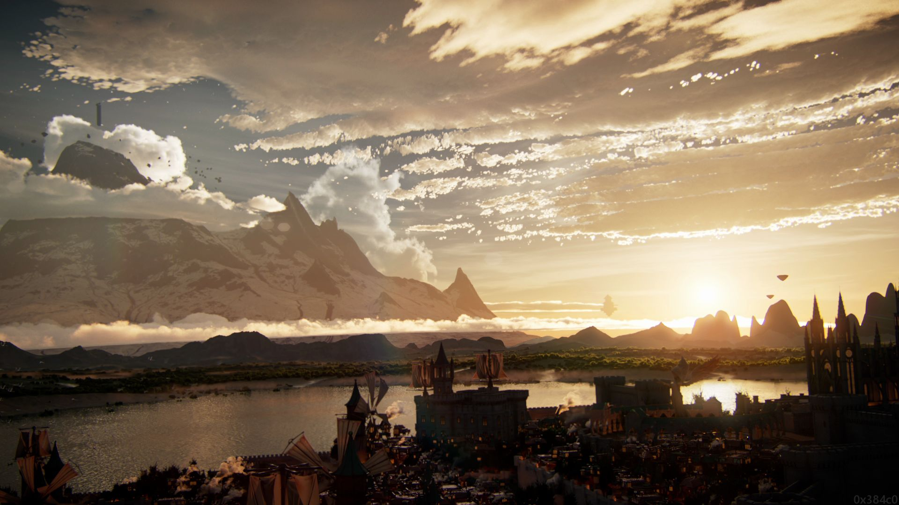

## Requirements
### Harware
* 30 GB storage
* 32 GB RAM
* GPU

### Software
* SideFX Houdini 19
* Foundry Nuke 13
* Terragen v4.4
* Gaea 1.2
* SpeedTree Cinema v8
* Blender 3

### Building Instructions
* install required software
* open .hip project
* check software paths in /tasks/topnet/control_network
* cook node /tasks/topnet/output0 

### Pipeline

### Render:

### Videos

