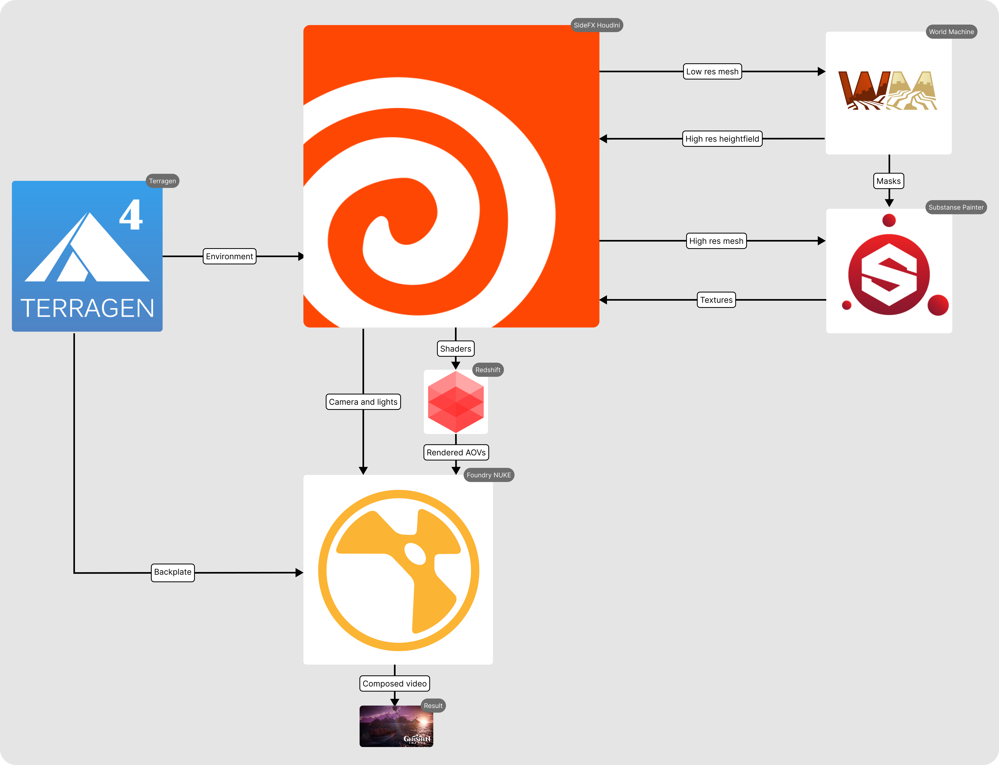
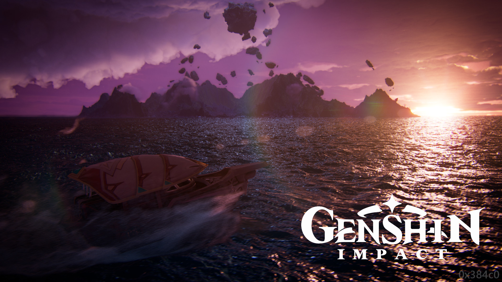

## Requirements
### Harware
* 200 GB storage
* 16 GB RAM
* GPU

### Software
* SideFX Houdini 17.5.173
* Redshift 2.6.41
* Substance Painter 2020.2.2 (6.2.2) Build 661
* World Machine 
* Terragen v4.4.44
* Foundry Nuke 13.1v3

### Pipeline

### Render:

### Video

